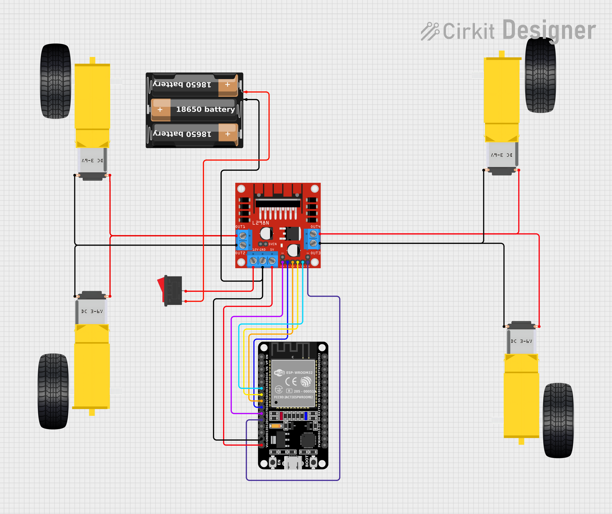
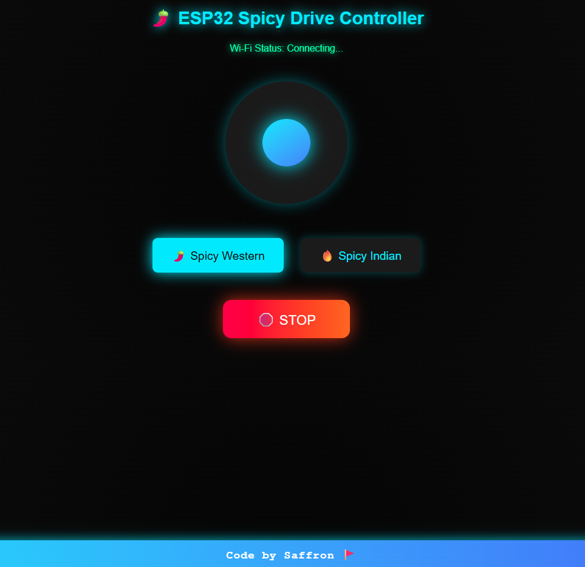

# 🚗 ESP_WEBCAR

### 🔓 Open-Source IoT Project  
**ESP_WEBCAR** — an offline ESP32 WebSocket joystick car controller powered by an **L298N motor driver**.  
Both the **code** and **web UI** run directly on the ESP32 in **Access-Point (AP)** mode, so your phone or laptop can connect **directly** to it and drive the car — **no internet or router required!**

---

## 📁 Repository Structure

```

ESP_WEBCAR/
├─ README.md                <- This file (project overview, wiring, upload steps)
├─ LICENSE
├─ src/
│  ├─ esp_webcar.ino        <- Main Arduino sketch (ESP32 code)
│  └─ web_ui.html           <- Joystick web page (separate copy for clarity)
├─ docs/
│  ├─ wiring-diagram.svg    <- Circuit schematic / connection diagram
│  └─ photos_videos_link    <- Photos or video links of assembled car

```

---

## 🧩 1) What This Project Contains

- 🧠 **ESP32 firmware** (Arduino sketch) that:
  - Starts a Wi-Fi Access Point  
  - Hosts and serves a web page  
  - Accepts joystick commands via **WebSocket**  
  - Controls an **L298N motor driver**  
  - Displays live debug info  

- 🌐 **Responsive Web UI** with:
  - Single joystick (forward, back, left, right)
  - Two speed modes:
    - 🌶 **Spicy Western (70%)**
    - 🔥 **Spicy Indian (100%)**
  - 🛑 **STOP button**
  - 📶 Live Wi-Fi + Debug status

---

## ⚙️ 2) Parts List (Basic)

| Component | Description |
|------------|-------------|
| **ESP32 Dev Board** | e.g., DevKitC / NodeMCU-32S |
| **L298N Motor Driver** | Dual H-bridge driver for DC motors |
| **4 × DC Geared Motors** | For left & right wheel control |
| **Battery Pack** | e.g., 18650 Li-ion 3.7V × 3 (≈11.1V total) |
| **Wires / Connectors** | Male-female jumper wires |
| **Chassis / Frame** | Small wooden, acrylic, or PCB base |
| *(Optional)* | 5V regulator for L298N logic |

---

## 🔌 3) Wiring (Pin Mapping & Notes)

### ESP32 ↔ L298N
| ESP32 Pin | L298N Pin | Description |
|------------|------------|-------------|
| GPIO26 | IN1 | Left motor forward |
| GPIO25 | IN2 | Left motor backward |
| GPIO33 | IN3 | Right motor forward |
| GPIO32 | IN4 | Right motor backward |
| GPIO27 | ENA | Left motor enable (PWM) |
| GPIO14 | ENB | Right motor enable (PWM) |
| GND | GND | Common ground (ESP32 ↔ L298N ↔ Battery) |

🔋 **Power:**
- **Battery (+)** → L298N **Vmotor**
- **Battery (–)** → L298N **GND**
- **ESP32 GND** → **L298N GND** (must be common)
- **Check jumper:**  
  If your L298N has a 5V logic jumper, ensure it’s properly set when powering from battery.

---

### ⚠️ Important Notes

- L298N has **two supplies**:  
  - `Vmotor` (motor power, e.g. 7.4V)  
  - `Vcc` (logic 5V)
- Always **connect all grounds together.**
- If logic 5V is taken from battery, ensure proper regulation.
- Avoid feeding 12V directly to ESP32 — it’s only 3.3V tolerant!

---

## 🧮 4) Simple ASCII Circuit Diagram

```

BATTERY + ---------+-----------------> L298N VMOT
|
+--> (motors connected to L298N outputs)
BATTERY - -------------------------------> L298N GND ----+---- ESP32 GND
|
ESP32 GPIO26 --> IN1 (L298N)                                |
ESP32 GPIO25 --> IN2 (L298N)                                |
ESP32 GPIO33 --> IN3 (L298N)                                |
ESP32 GPIO32 --> IN4 (L298N)                                |
ESP32 GPIO27 --> ENA (L298N enable A / PWM)                 |
ESP32 GPIO14 --> ENB (L298N enable B / PWM)                 |
(Ensure L298N 5V logic jumper is set according to your configuration)

```

📘 **Detailed Wiring Diagram:**  
`docs/wiring-diagram.svg`

---

## 🚀 5) Project Description

**ESP_WEBCAR** is an offline, Wi-Fi-based **remote control car** using an **ESP32** and **L298N motor driver**.  
The ESP32 hosts a joystick web interface through its built-in **Access Point** mode, allowing direct control from any smartphone or laptop browser — no internet or router required!

### ✨ Features
- 🎮 Single joystick for forward, reverse, left, and right control  
- 🌶 Two speed modes:
  - **Spicy Western** — 70% power  
  - **Spicy Indian** — 100% power  
- 🛑 Emergency STOP button  
- 📶 Live Wi-Fi connection indicator  
- ⚙️ Debug panel displaying direction & PWM values  
- 🖥️ Works seamlessly on both **mobile** and **desktop** browsers  

---

## 🧠 6) Circuit Diagram & Images

## ⚡ Circuit Diagram
Here’s the wiring setup for the ESP32-powered car:





---

## 🌐 Web Interface
Below is the control webpage UI for the car:





---

## 🧠 7) What You Learn from This Project

Through the **ESP_WEBCAR** project, you gain both **practical IoT experience** and **embedded system knowledge**.

### 📘 Key Learnings

- 🛰 **Access Point Mode:** How to run the **ESP32** in AP mode and host a web-based control UI.  
- 🔄 **WebSocket Communication:** Establishing real-time bidirectional data transfer between the **browser** and the **embedded device**.  
- 🎮 **Joystick Control Mapping:** Converting joystick X–Y axes into **differential motor control** (mixing throttle and turn).  
- ⚙️ **Motor Control with L298N:** Using **PWM signals** from ESP32 to control motor speed and direction.  
- 🧩 **Hardware Fundamentals:** Understanding **common ground** concepts and the difference between **motor supply** and **logic supply**.  
- 🧪 **Debugging & Tuning:** Testing embedded web interfaces and adjusting control sensitivity for smoother driving.  
- 💾 **Open-Source Packaging:** Structuring and documenting an IoT project for sharing on platforms like **GitHub**.

---

## 🚀 8) Future Improvements (More to Add)

Here are some enhancements you can explore to make the project even more powerful and feature-rich:

- ⚡ **Software PWM Fallback:** Add support for boards that lack `analogWrite` or LEDC channels.  
- 🔋 **Battery Safety Features:** Implement low-battery detection and automatic safe-stop function.  
- 📡 **OTA (Over-The-Air) Updates:** Enable firmware updates wirelessly via Wi-Fi.  
- 📶 **Bluetooth Control Fallback:** Add Bluetooth-based manual control option when Wi-Fi isn’t available.  
- ⚙️ **Speed Calibration:** Build a UI for speed calibration and joystick fine-tuning (dead zone, smoothing, etc.).  
- 🎥 **Camera Module Integration:** Add ESP32-CAM or external camera for **live video streaming**.  
- 🛣️ **Lane Detection (AI Add-on):** Integrate basic computer vision for autonomous line-following capability.

---

## 🌐 Internet of Things (IoT) Overview

### 🚗 How This Project Is an IoT Project

The **ESP32 Spicy Drive Controller** is a perfect example of an **IoT (Internet of Things)** project because it connects the physical world (the car and its motors) with the digital world (a web-based controller) using the internet.

#### 💡 Key IoT Features Demonstrated:
1. **Wi-Fi Connectivity:**  
   The ESP32 hosts a web server and connects over Wi-Fi, allowing you to control the car using any device (mobile, laptop, etc.) via a browser.

2. **Smart Device Communication:**  
   Commands from the web interface are wirelessly transmitted to the ESP32, which processes them and controls the motor driver — making it a "smart car."

3. **Real-Time Remote Control:**  
   The system allows immediate response to user inputs like movement and speed changes, demonstrating real-time IoT communication.

4. **Human–Machine Interaction:**  
   The modern web interface acts as an IoT dashboard, providing intuitive control similar to industrial or home automation systems.

5. **Wireless Automation:**  
   No physical connection (like remote or Bluetooth controller) is needed — everything works wirelessly through a local Wi-Fi network, showing the principle of IoT-based automation.

---

### 🌍 Importance of the Project in IoT

| IoT Concept | Role in This Project |
|--------------|----------------------|
| **Connectivity** | Uses Wi-Fi to connect a real object (the car) to the internet. |
| **Automation** | Enables remote control and operation without manual switches. |
| **Embedded Intelligence** | The ESP32 acts as the "brain," interpreting commands and controlling motors. |
| **Human–Machine Interface** | The web dashboard provides a clean, user-friendly control system. |
| **Scalability** | The setup can easily be expanded with sensors, GPS, or cameras for advanced IoT applications. |

---

### 🔧 Real-World Applications

- **Smart Robotic Cars** – Prototype for IoT-controlled delivery or surveillance vehicles.  
- **IoT Learning Platform** – Great for understanding the integration of hardware and internet technologies.  
- **Automation Demonstration** – Suitable for exhibitions or practical IoT demonstrations.  

---

### 🧠 Summary

> The **ESP32 Spicy Drive Controller** combines embedded electronics, wireless communication, and web-based control to create a fully interactive IoT system.  
> It embodies the essence of IoT — connecting everyday devices to the internet for smarter, more efficient operation.

---

## 💫 Conclusion

The **ESP32 Spicy Drive Controller** is more than just a car — it’s a glimpse into the future of connected technology.  
By combining **IoT concepts**, **embedded control**, and a **modern web interface**, this project demonstrates how creativity and innovation can turn simple components into an intelligent system.

It serves as a strong foundation for future advancements like:
- Obstacle detection using sensors 🧭  
- GPS-based navigation 🌍  
- Voice or smartphone-controlled automation 📱  

Each improvement will bring it one step closer to becoming a complete IoT-based smart vehicle.

---

### 💡 Crafted with Innovation by  
# **Saffron Innovators Hub** ⚙️  
*“Turning ideas into intelligent systems.”*

---


